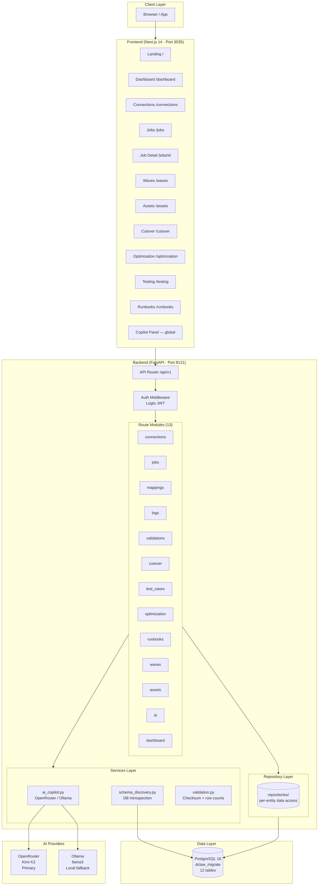
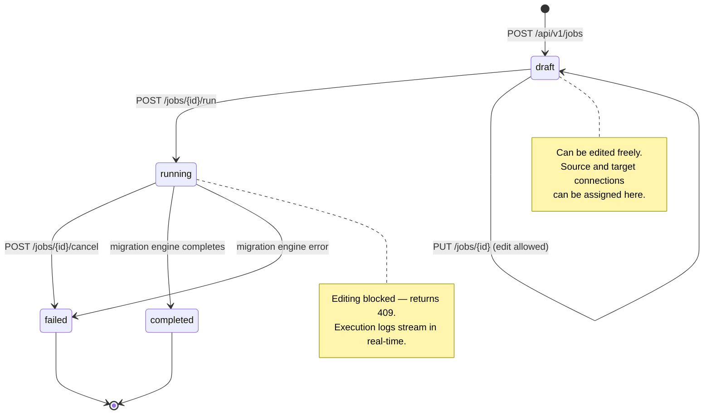
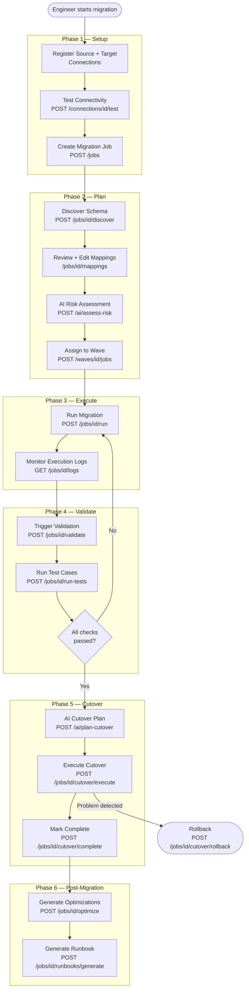
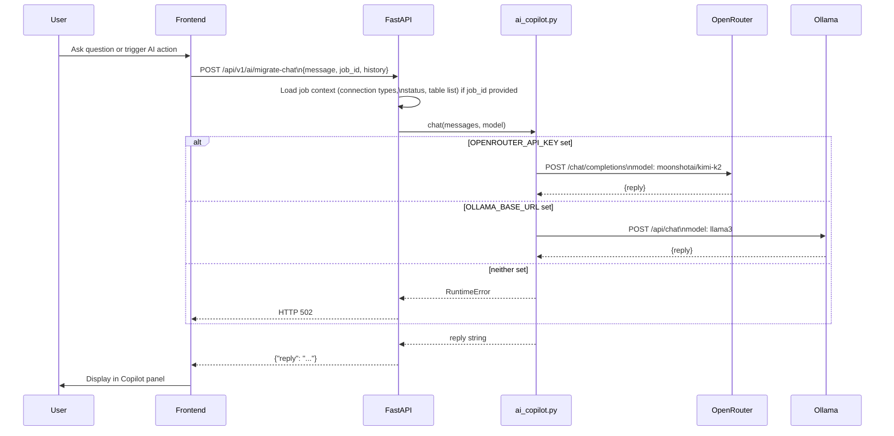
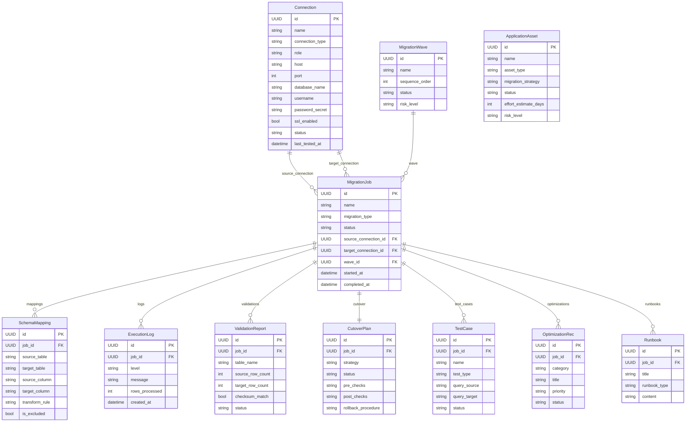
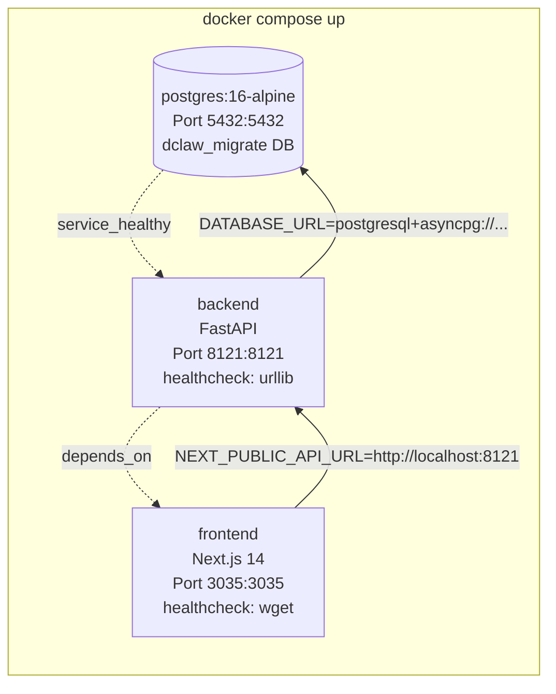
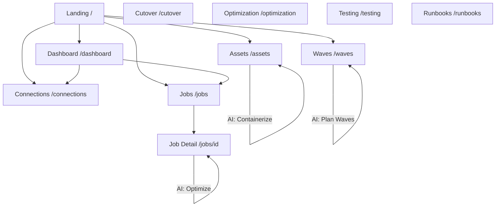
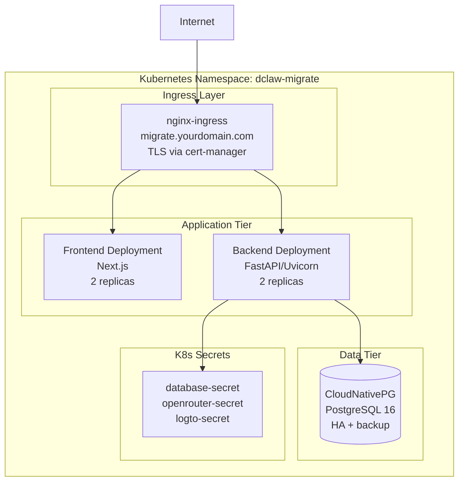

# DClaw Migrate — Architecture Diagrams

> Source diagrams for infographic regeneration. Rendered with Mermaid.
> Version: 1.4 · Updated: 2026-05-31

---

## 1. System Architecture

---

## 2. Migration Job State Machine

---

## 3. Full Migration Workflow

---

## 4. AI Request Flow

---

## 5. Data Model (Entity Relationships)

---

## 6. Docker Compose Service Map

---

## 7. Screen Navigation Map

---

## 8. AI Endpoint Map

| Endpoint | Context Used | Primary Use |
|----------|-------------|-------------|
| `/ai/migrate-chat` | Job: name, type, status, connections, tables | General migration Q&A |
| `/ai/suggest-mappings` | Job + schema mappings | Column type mapping suggestions |
| `/ai/assess-risk` | Job + connection types + migration type | Pre-migration risk report |
| `/ai/plan-waves` | Wave list + job list | Optimal wave sequencing |
| `/ai/assess-application` | Asset: type, current host, strategy | Effort estimate + strategy |
| `/ai/plan-cutover` | Job + cutover plan | Checklist + timing |
| `/ai/cloud-strategy` | Asset: type, workload description | Cloud provider comparison |
| `/ai/containerize` | Asset: type, current platform | Dockerfile + K8s manifest guidance |

---

## 9. Kubernetes Deployment Architecture

